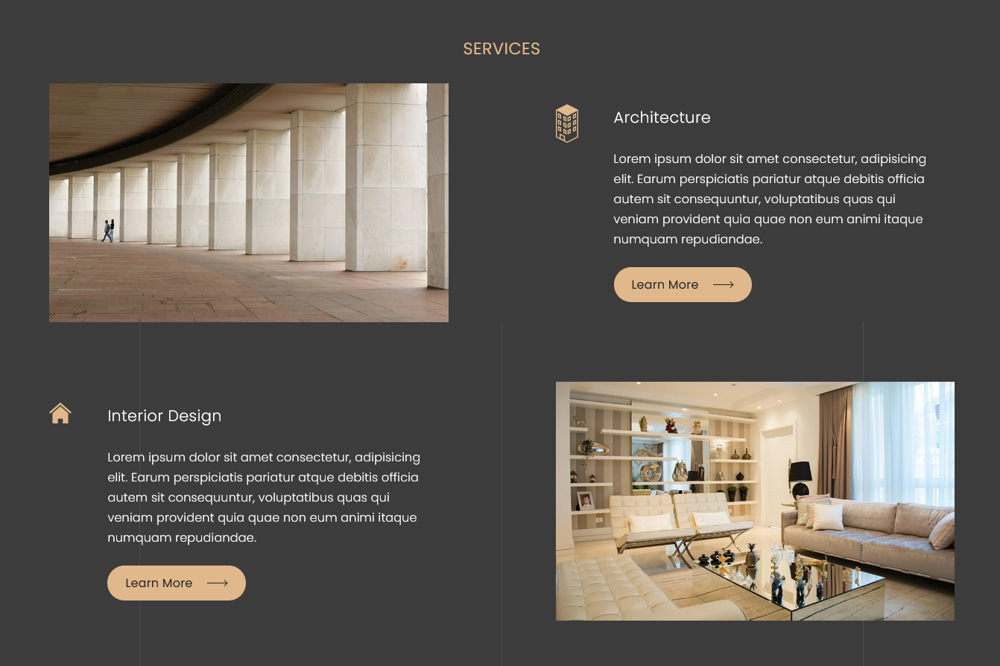

## A slick, elegant portfolio website for architects and interior designers.

This is a one-page fully responsive website that contains a Header, About, Services,
Portfolio, Blog and Footer section.

## Website Preview

## Built with

This website has been built with the following technologies:

1. HTML
2. Vanilla CSS
3. Vanilla JavaScript

## Demo

[Click here](https://deepug9787.github.io/architect-portfolio-website/) to view a live demo.

## Usage Instructions

No setup required. Just navigate to the project folder and open the index.html file.

## License

This project is licensed under the MIT License.
